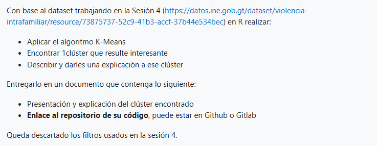

### Tarea 4 — K‑Means Clustering (R)



Proyecto en R para aplicar el algoritmo K‑Means sobre el conjunto de datos de violencia intrafamiliar (Guatemala, 2024). El trabajo está implementado en `Tarea4.Rmd` y genera visualizaciones 2D y una proyección 3D de clústeres para variables de víctima y agresor.


## Contenido del repositorio
- `Tarea4.Rmd`: cuaderno principal en R Markdown con todo el flujo de trabajo.
- `Tarea4.nb.html`: salida HTML generada por R al ejecutar el cuaderno.
- `base-de-datos-violencia-intrafamiliar-ano-2024_v3.xlsx`: datos utilizados.
- `diccionario-de-variables-violencia-intrafamiliar-2023.xlsx`: referencia de variables.
- `Tarea4.png`: imagen de la consigna/actividad usada en esta README.


## Requisitos
- R (4.4+ recomendado)
- RStudio (opcional pero recomendado)
- Paquetes R utilizados en `Tarea4.Rmd`:
  - `arules`
  - `ggplot2`
  - `readxl`
  - `remotes` (para instalar `ggalt` desde GitHub)
  - `ggalt` (visualización: `geom_encircle`)

Instalación rápida desde una sesión de R:

```r
install.packages(c("arules","ggplot2","readxl","remotes"))
remotes::install_github("hrbrmstr/ggalt")
```


## Datos
- Archivo: `base-de-datos-violencia-intrafamiliar-ano-2024_v3.xlsx`.
- Variables de interés (subconjuntos usados en el cuaderno):
  - Víctima: `HEC_TIPAGRE`, `QUIEN_REPORTA`, `VIC_EDAD`, `VIC_SEXO`, `TOTAL_HIJOS`, `VIC_OCUP`, `VIC_DISC`, `VIC_ESCOLARIDAD`.
  - Agresor: `AGR_EDAD`, `AGR_SEXO`, `TOTAL_HIJOS`, `AGR_OCUP`, `AGR_ESCOLARIDAD`.
- Tratamiento de faltantes/códigos especiales:
  - Se reemplazan `NA` por `-1` para permitir K‑Means.
  - Se filtra `TOTAL_HIJOS != 99` y, cuando aplica, escolaridad `!= 99`.


## Ejecución
1. Abra `Tarea4.Rmd` en RStudio o ejecute desde R:
   
   ```r
   rmarkdown::render("Tarea4.Rmd", output_format = "html_notebook")
   ```
   
   Esto generará/actualizará `Tarea4.nb.html`.

2. Asegúrese de que los archivos `.xlsx` estén en el mismo directorio que `Tarea4.Rmd`.

3. Si es la primera ejecución, instale los paquetes indicados en la sección Requisitos.


## Flujo técnico (resumen)
- Carga de datos con `readxl::read_excel`.
- Selección de columnas relevantes para distintos escenarios (víctima/agresor y 2D/3D).
- Limpieza mínima: imputación de `NA` a `-1` y exclusión de códigos 99.
- Entrenamiento de varios modelos K‑Means:
  - Ejemplos: `kmeans(data_use, centers = 3)`, `kmeans(data_child, centers = 7)`, etc.
- Visualización:
  - 2D con `ggplot2` y centroides superpuestos.
  - Envolventes por clúster con `ggalt::geom_encircle`.
  - Proyección 3D manual usando `persp` + `trans3d` para puntos y centroides.
  - Pares de proyecciones 2D con `pairs` para las variables 3D.


## Cómo reproducir las figuras clave
- Ocupación víctima vs. total de hijos (7 clústeres) con centroides y envolventes.
- Ocupación agresor vs. total de hijos (6 clústeres) con centroides y envolventes.
- Vista 3D de agresor: `AGR_OCUP × AGR_ESCOLARIDAD × TOTAL_HIJOS` con centroides.
- Matriz de pares coloreada por clúster.

Ejemplo mínimo para la figura 2D con envolventes (víctima):

```r
library(ggplot2)
library(ggalt)
# data_child y cluster_without_99_child deben existir desde el cuaderno
ggplot(data_child, aes(x = VIC_OCUP, y = TOTAL_HIJOS,
                       color = as.factor(cluster_without_99_child$cluster),
                       shape = as.factor(cluster_without_99_child$cluster))) +
  geom_point(size = 3, alpha = 0.7) +
  geom_point(data = as.data.frame(cluster_without_99_child$centers),
             aes(x = VIC_OCUP, y = TOTAL_HIJOS), color = "black",
             size = 5, shape = 21) +
  geom_encircle(aes(group = cluster_without_99_child$cluster,
                    fill = as.factor(cluster_without_99_child$cluster)),
                alpha = 0.2, s_shape = 1, expand = 0.05) +
  theme_minimal()
```


## Interpretación sugerida del clúster
- Identifique el clúster con patrón más interesante (p. ej., alta `VIC_OCUP` con baja `TOTAL_HIJOS` o viceversa).
- Revise centroides (`kmeans_model$centers`) y tamaños (`kmeans_model$size`).
- Cruce con el diccionario de variables para traducir códigos a categorías.
- Documente hallazgos y posibles hipótesis de causalidad o sesgos de reporte.


## Notas técnicas
- K‑Means asume variables numéricas y distancia euclidiana; aquí se usan códigos numéricos de variables categóricas, por lo que la interpretación debe ser cauta. Considere escalamiento y/o técnicas para datos categóricos en trabajos futuros.


## Licencia
Uso académico/educativo. Proyecto académico - Universidad de San Carlos de Guatemala
